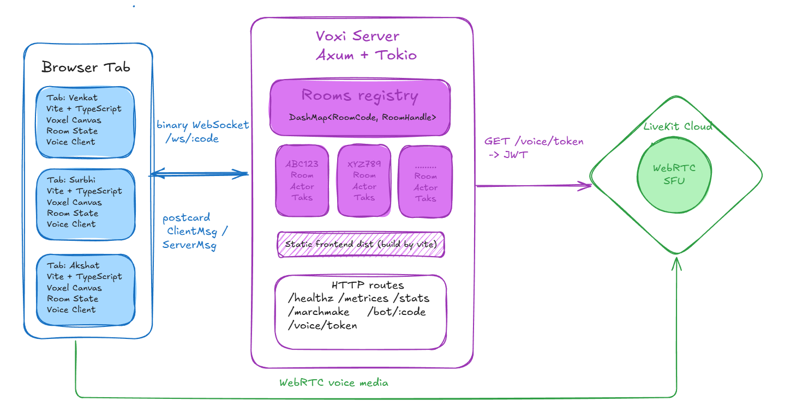
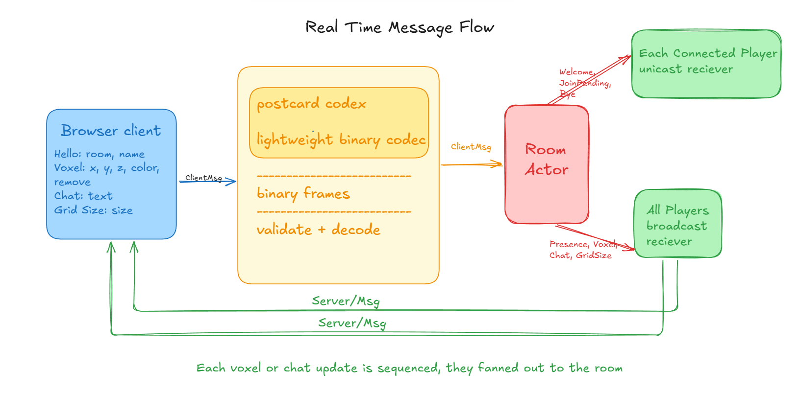
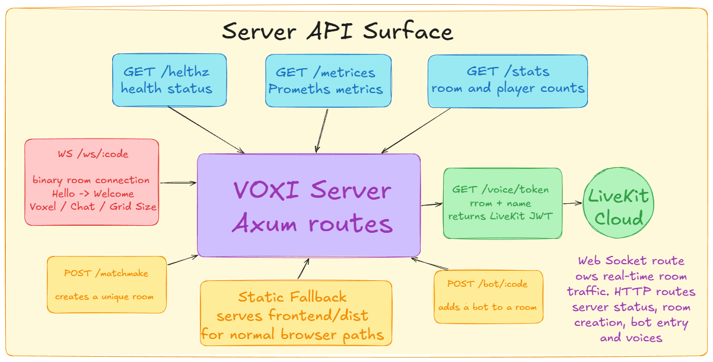
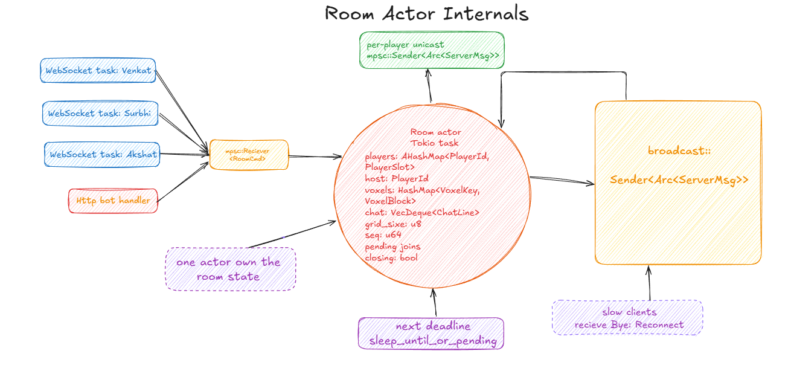

# VOXI

**A real-time collaborative voxel room for building together.**

VOXI lets people create or join a room, place textured voxel blocks on a shared 3D canvas, chat in real time, and use optional voice chat. The project is built as a TypeScript + Three.js frontend with a Rust, Axum, and Tokio realtime server.

## Highlights

- Shared voxel canvas with live placement and removal updates
- Solo and multiplayer rooms with six-character room codes
- Textured materials: grass, stone, glass, wood, water, lava, and fire
- Landscape choices: grass, mud, sand, snow, and water
- Build presets for a house, castle, and trees
- Room chat and participant list
- Optional LiveKit voice chat with shared mute-state indicators
- Host-controlled grid sizes
- Keyboard-only voxel history: undo and redo
- Responsive voxel-inspired interface and interactive footer

## Screenshots

### System architecture



### Real-time message flow



### Server API surface



### Room actor internals



## How it works

1. A player opens the landing page and starts a solo room or creates a multiplayer room.
2. Multiplayer browsers connect to `GET /ws/:code` with a binary Postcard `Hello` message.
3. The server places each room inside a dedicated Tokio actor task.
4. Voxel edits, chat, presence changes, grid updates, and microphone mute-state updates are validated and broadcast to all players in the room.
5. Voice audio does not travel through the VOXI WebSocket. The browser requests a short-lived LiveKit token from the server, then sends WebRTC media directly to LiveKit.

## Architecture

The workspace has three Rust crates and one frontend application:

| Area | Location | Responsibility |
| --- | --- | --- |
| Frontend | `frontend/` | Vite, TypeScript, Three.js voxel renderer, room UI, chat, voice controls |
| Shared protocol | `crates/voxi-proto/` | Rust message types, validation, and Postcard binary codec |
| Room engine | `crates/voxi-room/` | Per-room actor, multiplayer state, presence, chat, voxel and grid updates |
| Server | `crates/voxi-server/` | Axum routes, WebSocket upgrades, room registry, LiveKit token minting, optional tracking |

Every multiplayer room has one actor that owns its state. WebSocket tasks send commands to that actor through a channel; the actor sends room events back through broadcast and per-player unicast channels. This makes room state authoritative and keeps all connected clients synchronized.

## Features

### Build together

Click the canvas to add a voxel. Hold `Shift` while clicking to remove the top block in a column. Drag to orbit the view and scroll to zoom.

Choose a color or material from the toolbar, select a land style, and pick the grid size. In multiplayer rooms, only the current host can change the grid size.

### Presets

Choose a preset, then click any canvas cell to place the ready-made structure at that location:

- `HOUSE` creates a compact house with walls, roof, door, and windows.
- `CASTLE` creates a stone courtyard with four towers.
- `TREES` creates a small group of wooden trees with leafy canopies.

Preset blocks are sent through the same realtime voxel path as normal clicks, so everyone in a multiplayer room sees them.

### Undo and redo

There are no extra buttons for history controls:

| Action | Windows / Linux | macOS |
| --- | --- | --- |
| Undo | `Ctrl + Z` | `Cmd + Z` |
| Redo | `Ctrl + Shift + Z` or `Ctrl + Y` | `Cmd + Shift + Z` or `Cmd + Y` |

Shortcuts are ignored while typing in chat or another text field.

### Voice chat

Click the microphone next to your name to connect and publish your microphone. Clicking it again mutes or unmutes it.

- A live microphone is shown as active.
- A player who mutes their microphone is shown with a red muted icon for everyone in the room.
- Clicking another player's microphone icon is a local-only listener mute; it does not mute them for other people.

## Run locally

### Requirements

- Rust stable toolchain
- Node.js 20 or newer
- npm
- Optional: a LiveKit project for voice chat

### 1. Start the server

```bash
cargo run -p voxi-server
```

The server listens on `http://127.0.0.1:7070` by default.

### 2. Start the frontend

```bash
cd frontend
npm ci
npm run dev
```

Open `http://127.0.0.1:5173` in a browser. Vite proxies WebSocket and voice-token requests to the local Rust server.

## Configuration

Create `crates/voxi-server/.env` for server-only values when needed:

```dotenv
# Optional voice chat configuration
LIVEKIT_API_KEY=your_livekit_api_key
LIVEKIT_API_SECRET=your_livekit_api_secret
LIVEKIT_URL=wss://your-livekit-host

# Optional persistent play tracking
TURSO_DATABASE_URL=libsql://your-database.turso.io
TURSO_AUTH_TOKEN=your_turso_auth_token

# Optional server overrides
PORT=7070
VOXI_WORDS_DIR=crates/voxi-server/data
VOXI_DIST_DIR=frontend/dist
```

For a separately hosted frontend, set this during the Vite build:

```dotenv
VITE_SERVER_URL=https://your-voxi-server.example.com
```

If no `VITE_SERVER_URL` is set, local development uses the Vite origin. Production falls back to the configured VOXI server URL in `frontend/src/server.ts`.

## HTTP and WebSocket API

| Route | Purpose |
| --- | --- |
| `GET /healthz` | Basic health response: `ok` |
| `GET /metrics` | Prometheus-compatible active-room and optional tracking metrics |
| `GET /stats` | JSON room, play, and unique-player counts |
| `GET /ws/:code` | Main binary realtime room connection |
| `GET /voice/token?room=&name=` | Creates a LiveKit token for a room participant |
| `POST /matchmake` | Creates or finds a room for a requested size and bot count |
| `POST /bot/:code` | Adds a server-side helper to a room |

The WebSocket uses Postcard-encoded binary messages. Key client messages are `Hello`, `Voxel`, `Chat`, `GridSize`, and `Voice`. The server broadcasts authoritative room events including `Presence`, `Voxel`, `Chat`, and `Voice`.

## Project structure

```text
voxi/
├── frontend/
│   ├── src/main.ts          # Room UI, chat, presets, shortcuts
│   ├── src/voxelWebgl.ts    # Three.js voxel renderer and materials
│   ├── src/voice.ts         # LiveKit microphone and speaker handling
│   ├── src/proto.ts         # TypeScript Postcard protocol mirror
│   └── src/ws.ts            # Reconnecting WebSocket client
├── crates/
│   ├── voxi-proto/          # Shared protocol and validation
│   ├── voxi-room/           # Room actor and room state
│   └── voxi-server/         # Axum routes, WebSockets, LiveKit tokens
├── docs/architecture/       # Architecture diagrams used in this README
├── Dockerfile                # Production multi-stage container build
└── vercel.json               # Frontend deployment configuration
```

## Build and verify

```bash
# Frontend typecheck and production bundle
npm --prefix frontend run build

# Rust protocol and room tests
cargo test -p voxi-proto -p voxi-room

# Compile server tests
cargo test -p voxi-server --no-run
```

## Deployment

The frontend can be built and deployed as a Vite application. The Rust server can run as a container using the included `Dockerfile`, which builds the server and frontend, then serves the frontend build as a static fallback alongside the API and WebSocket routes.

Set `VITE_SERVER_URL` to the public server origin when the frontend and server are deployed on different domains. Configure the three LiveKit variables for voice chat; without them, voxel collaboration and chat still work, while voice token requests return an unavailable response.

## License

MIT
